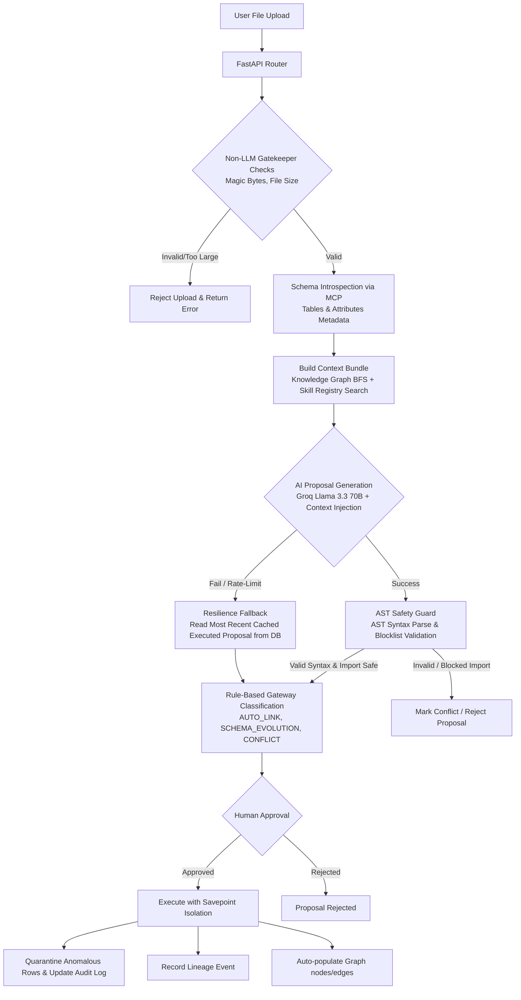

# Conduit

Conduit is an autonomous agentic data engineering framework that detects schema drift between incoming data files and target database tables, generates safe transformation plans, validates them, and presents them to a human engineer for approval before execution.

## Project Structure

```
Conduit/
├── backend/                  # FastAPI backend (Python)
│   ├── app/
│   │   ├── main.py
│   │   ├── database.py
│   │   ├── models.py
│   │   ├── schemas.py
│   │   ├── routers/          # /ingest, /proposals, /audit, /quarantine, /sources
│   │   ├── services/         # mcp, ai, gateway, execution, validation
│   │   └── core/config.py
│   ├── Dockerfile
│   ├── requirements.txt
│   └── .env.example
├── frontend/                 # Next.js frontend (TypeScript)
│   ├── src/
│   │   ├── app/              # App router pages
│   │   ├── components/       # Shared UI components
│   │   └── lib/              # API client, types, formatters
│   ├── tailwind.config.js
│   ├── tsconfig.json
│   └── package.json
├── db/
│   ├── seed_warehouse.sql    # Auto-loaded on Postgres init
│   └── demo_csvs/            # Test files
├── docker-compose.yml        # Spins up Postgres + API
└── README.md
```

## System Architecture

The following flowchart illustrates the Conduit ingest, validation, and execution pipeline:



## Quick Start

### 1. Backend (FastAPI)

```bash
cd Conduit
cp backend/.env.example backend/.env
# Edit .env to add GROQ_API_KEY
docker compose up -d
```

The API will be available at `http://localhost:8000`.

### 2. Frontend (Next.js)

```bash
cd Conduit/frontend
npm install
npm run dev
```

The UI will be available at `http://localhost:3000`.

The frontend proxies `/api/*` requests to the backend, so no extra config is needed.

## Demo Data

Test the system with these files (in `db/demo_csvs/`):

- `clean_orders.csv` — clean schema, expected to land in `AUTO_LINK`
- `drifted_orders.csv` — has renames, extra columns, and nulls → `SCHEMA_EVOLUTION`
- `conflicted_orders.csv` — type mismatches and missing required columns → `CONFLICT`

## API Endpoints

| Method | Endpoint | Purpose |
|--------|----------|---------|
| `POST` | `/api/ingest` | Upload file + generate AI proposal |
| `GET` | `/api/proposals/{id}` | Retrieve proposal details |
| `POST` | `/api/proposals/{id}/approve` | Execute approved transformation |
| `POST` | `/api/proposals/{id}/reject` | Reject a proposal |
| `GET` | `/api/audit` | List execution history |
| `GET` | `/api/audit/{id}` | Full audit details for one execution |
| `GET` | `/api/quarantine` | List quarantined rows |
| `GET` | `/api/sources` | List registered data sources |
| `GET` | `/api/skills` | List registered skills (category/status filters, paginated) |
| `GET` | `/api/skills/{id}` | Skill details (includes scripts, examples, issues) |
| `POST` | `/api/skills` | Register a new transformation skill |
| `GET` | `/api/graph/nodes` | List all nodes in the relationship graph |
| `GET` | `/api/graph/edges` | List all edges in the relationship graph |
| `GET` | `/api/graph/lineage/{entity}` | BFS lineage traversal starting from an entity |
| `GET` | `/api/lineage` | List all data lineage events (paginated) |
| `GET` | `/api/lineage/{proposal_id}` | Lineage events associated with a specific proposal |

## Classification States

Every proposal is classified into one of three states:

- **AUTO_LINK** — No drift, high confidence (>0.92)
- **SCHEMA_EVOLUTION** — Detectable drift with clear fix
- **CONFLICT** — Type mismatches, missing required columns, or low confidence

The backend enforces rule-based overrides on top of AI recommendations.

## AI Tools & Structured Compilation

Conduit utilizes state-of-the-art LLMs combined with rigorous deterministic guardrails to ensure robust schema resolution and code safety:

- **Model**: Powered by the Groq API utilizing `llama-3.3-70b-versatile`. This model offers high-speed, low-latency, and highly structured JSON outputs specifying detailed mappings and Pandas transformations.
- **AST Safety Guard**: Any AI-generated transformation code is validated prior to execution. Using `ast.parse` checks Python syntax validity before rendering; imports blocklist is enforced, preventing any imports or execution of potentially dangerous libraries or builtins (e.g. blocking `os`, `sys`, `subprocess`, `eval`).
- **Fail-safe Fallback Cache**: A resilience layer intercepts API errors, timeouts, or rate limits. If the Groq LLM is unreachable, the system attempts to fetch the most recent successfully executed proposal from the database for the matching source/target schema, serving it as a fallback proposal.

## Frontend Pages

| Route | Purpose |
|-------|---------|
| `/` | Overview dashboard with stats, recent executions, and source status |
| `/ingest` | File upload + inline proposal review with confidence scoring |
| `/proposals` | All proposals in a table view |
| `/proposals/[id]` | Detailed proposal review with drift/code/prompt tabs and approve/reject actions |
| `/audit` | Audit ledger with status filters |
| `/audit/[id]` | Full audit detail with executed script, AI prompt, and raw response |
| `/quarantine` | Split-view of quarantined rows with raw data and failure reason |
| `/sources` | Registered data warehouse units and connectivity status |

## Verification and Local Testing

You can run isolated end-to-end integration and sanity checks on the ingestion, classification, approval, and audit endpoints using the `uv` environment. 

Ensure the backend server is running locally (e.g., via `docker compose up -d` or running FastAPI manually on port 8000), then execute:

```bash
uv run --with requests python Conduit/run_checks.py
```

This runs the automated checks defined in `run_checks.py`, which:
1. Simulates ingestion of clean data (`clean_orders.csv`), expecting automatic resolution (`AUTO_LINK`).
2. Simulates ingestion of drifted data (`drifted_orders.csv`), expecting a proposed fix (`SCHEMA_EVOLUTION`).
3. Simulates ingestion of conflicted data (`conflicted_orders.csv`), expecting mismatch detection (`CONFLICT`).
4. Approves the automatic resolution proposal to execute the database ingestion.
5. Verifies database auditing by querying execution logs.
6. Tests the database connectivity and registration source endpoints.

