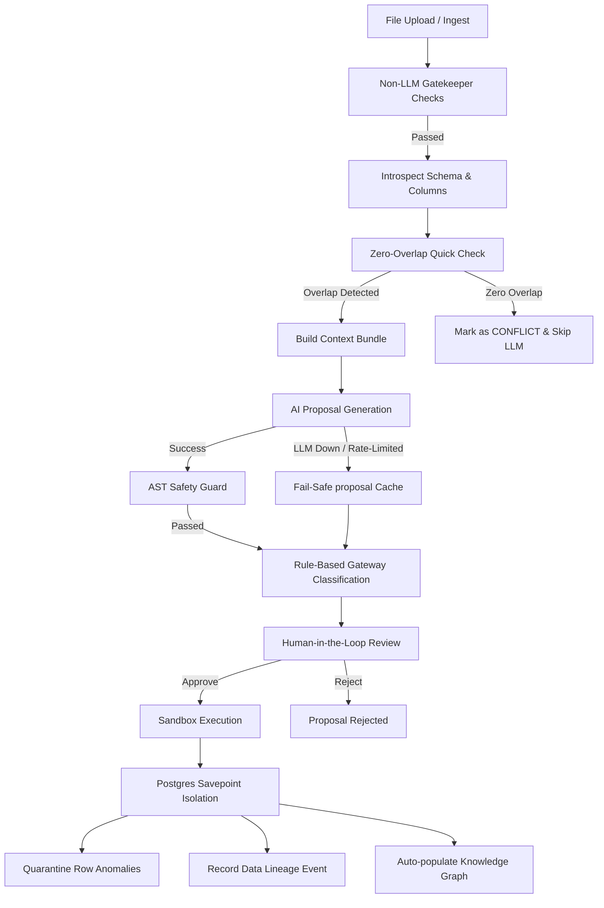

# Conduit — System Capabilities & Features Documentation

Conduit is an autonomous agentic data engineering framework that detects schema drift between incoming data files and target database tables, generates safe transformation plans, validates them against strict AST safety guards, and executes them with transaction isolation and automatic quarantine of anomalous rows.

Below is the exhaustive set of system capabilities provided by Conduit.

---

## 1. Core Capabilities & Architecture

Conduit behaves as an intelligent intermediary between raw, untrusted data files (CSVs/Parquets) and a production relational database. It automates ingestion and schema resolution through a multi-stage deterministic and agentic pipeline.

---

## 2. Comprehensive Capabilities Detail

### 2.1 File Gatekeeping & Safety
- **Magic Bytes Verification**: Inspects file headers to ensure the file format matches its claimed extension. Prevents uploading disguised executables, PDFs, or binary files.
- **Size Safeguards**: Automatically rejects files exceeding a hard limit of 50MB to protect server resources and execution memory.
- **Format Support**: Standardized parsing support for CSV (`.csv`) and Apache Parquet (`.parquet`) data payloads.

### 2.2 Relational Schema Introspection
- **Database Catalog Querying**: Connects directly to the PostgreSQL database to retrieve the target schema's exact attributes (column names, data types, nullability, constraints).
- **Metadata Management**: Maintains a registry of available target tables, tracking their live connection status.

### 2.3 Zero-Overlap Fast-Path Optimization
- **Token and Cost Saving**: Compares incoming file column names against target table column names before invoking the LLM.
- **Instant Conflict Classification**: If there is zero overlap between the incoming columns and target columns, the file is classified as `CONFLICT` with a confidence score of `0.0`, bypasses the LLM generator entirely, and saves API tokens.

### 2.4 Context-Aware AI Proposal Generation (Phase 2)
- **Knowledge Base Retrieval**: Interrogates the Knowledge Graph and Skill Registry *prior* to calling the LLM to construct a rich context bundle.
- **Context Injection**: Dynamically injects organizational context into the LLM system/user prompts:
  - **Known PII columns** that must be masked (e.g. `customer_email`).
  - **Business KPI impact** (e.g. "Directly affects monthly revenue dashboard metrics").
  - **Downstream dependencies** (tables or systems reading from the target table).
  - **Applicable registered skills** (e.g. `pii_masking`, `datetime_standardization`).
- **Structured JSON Synthesis**: Utilizes Groq `llama-3.3-70b-versatile` to produce a structured JSON document containing detected drifts, suggested mapping actions, plain-English reasoning, and the exact Python Pandas code required to bridge the schema gap.

### 2.5 AST Safety Sandbox
- **Syntax Validation**: Parses generated Python code using `ast.parse` to ensure it compiles before attempting to run it.
- **Import Blocklist**: Enforces a strict blocklist of forbidden Python imports and modules. Rejects code trying to import or use modules like `os`, `sys`, `subprocess`, `shutil`, `urllib`, or builtins like `eval()`, `exec()`, `open()`, and `__import__`. Prevents arbitrary code execution.

### 2.6 Rule-Based Gateway Classification
- Every ingestion proposal is evaluated against rules to categorize it into one of three execution states:
  - `AUTO_LINK`: Schema matches the target perfectly, or has minor, low-risk additions. High LLM confidence score (>0.92). Can be automatically approved or fast-tracked.
  - `SCHEMA_EVOLUTION`: Tolerable schema drift detected (column renames, extra column additions, nullability changes) with a clear, safe Pandas translation plan. Requires human approval.
  - `CONFLICT`: Severe issues (unresolved type mismatches, missing required columns, zero column overlap, or low confidence). Prompts warning signals and strict reviews.

### 2.7 Fail-Safe Fallback Cache
- **High Availability**: If the Groq LLM experiences outages, rate limits, or network timeouts, the system falls back to a database cache.
- **Historical Mappings**: Retrieves the most recent successfully executed proposal matching the source-target schema signature, ensuring ingestion pipelines remain functional during LLM downtime.

### 2.8 Sandbox Execution & Savepoint Isolation
- **Transaction Protection**: All generated transformation scripts execute within an isolated Python environment using temporary tables.
- **DB Savepoint Isolation**: Execution is wrapped inside a PostgreSQL database transaction. If any part of the insert fails (database constraint violation, query error), a savepoint rollback is triggered, ensuring the database state is never left in a corrupted or half-written form.

### 2.9 Granular Row Quarantine
- **Partial-Success Ingestion**: During execution, rows that violate constraints (e.g., value cannot be null, invalid data type) are isolated.
- **Anomalous Data Logging**: Valid rows are written to the database, while invalid rows are extracted and stored in `conduit.quarantine_records` alongside their respective exception messages and timestamps. This avoids rejecting entire file uploads due to a few bad rows.

### 2.10 Automated Knowledge Graph Updates
- **Self-Expanding Graph**: Upon successful pipeline execution, the system dynamically updates a PG-backed central knowledge graph (`conduit_graph` schema).
- **Entity & Relationship Auto-Linking**:
  - Automatically creates `FILE` and `TABLE` nodes if they do not exist.
  - Links them with `TRANSFORMS_INTO` edges.
  - Links tables to active skills via `USES_SKILL` edges.
- **Downstream Impact Analysis**: Traces the relationship graph outbound from any table or column (using BFS traversal) to display what dashboards, KPIs, or projects depend on it. Enables engineers to review downstream impacts before approving schema evolutions.
- **Data Lineage**: Registers granular events tracking the exact transformations, dates, and files mapping into target tables.

### 2.11 Skill Registry Management
- **Skill Lifecycle**: Supports registering, editing, versioning, and deprecating data transformation methods (skills).
- **Knowledge Sharing**: Allows teams to attach reference scripts and issue tracking references (e.g. Jira tags like SEC-101) directly to skills.
- **Standardized Code Generation**: Deprecating a skill automatically excludes it from future context bundles, ensuring the AI model uses the latest organizational standards.
